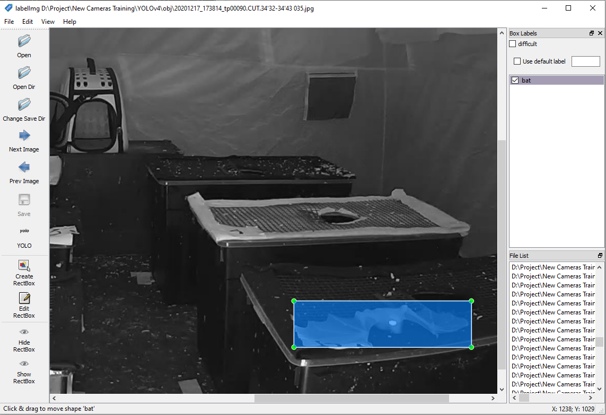
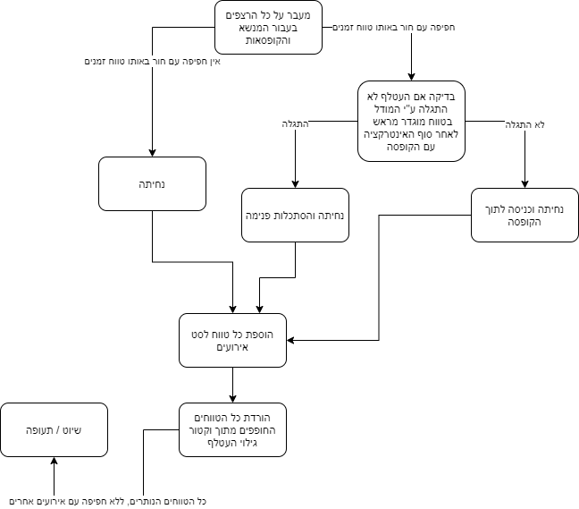

# yolov4-bats

## Background


This repository was developed based on an existing one - [(link)](https://github.com/theAIGuysCode/tensorflow-yolov4-tflite) for running the YOLOv4 algorithm for object detection on a local windows machine. In order to establish the environment for the bat tracking solution, it is necessary to follow the installation procedure outlined in the link.


## Model training 
This solution incorporates two neural network models, namely the weights files. One is used for the neural network to detect bats solely and the other is used to detect the different props inside the tent: The boxes, their holes and the carrier.

- To train either one of the weights files, this tutorial should be used [(youtube link)](https://www.youtube.com/watch?v=mmj3nxGT2YQ&t=1828s). As instructed in the tutorial, a data set of each element should be collected and labeled for the neural network.

- It is recommended to use or expand the existing datasets, collected during the development of this solution. 
The two may be found in the lab’s FTP under A folder named 'Idan Aviel'

- The dataset for the bat model consists of footage from the experiment alongside generic images of bats from the web. The environment’s dataset consists of only images from the experiments.

### Tagging and extracting frames

The images in the datasets were tagged using this python based tool - [github link](https://github.com/tzutalin/labelImg)

<p align="center"></p>

The frames were extracted from video footage using this tool - [free-video-to-jpg-converter](https://free-video-to-jpg-converter.en.uptodown.com/windows)

#### A note on choosing the images 
Bear in mind that although some frames may look inappropriate for the data set as they showcase the subject in an awkward position and with severe motion blur, these are the ones we actually want. The CNN (convolutional neural network) on which the YOLOv4 relies is trained based on extracted features of the bat that may not be visible to the naked eye, but may be very indicative during the detection process. 

Lastly, if a new model has been trained, it should be converted from darknet format to tensor-flow as instructed in the tutorial.

## Getting Started

### install conda
preferably the latest version from [conda.io](https://docs.conda.io/en/latest/miniconda.html)

### Conda environment

first, you need to create a conda environment - 

```bash 
conda env create -f conda-gpu.yml
conda activate yolov4-gpu
```

### command line code 

```bash 
python detect_video_final.py --weights_env ./checkpoints/env-1700iter-416 --weights ./checkpoints/bats-320-310721 --size 320 --model yolov4 --directory ./data/video
```

#### flags explanation 

##### weights_env 

environmental weights, to classify different objects in the experiment area - boxes, holes and carrier. these objects are identified in the first few frames of each video.

##### weights_bats

bat weights, to locate it during each frame

##### size

size in pixels of sliding convolutional window (320 / 416).
 a smaller window results in lower computational complexity but might cause inaccuracy. 

##### model 

default yolov4

##### directory 

Each directory contains a night of videos. the algorithm will run on each video and produce the outputs, which are elaborated in the next paragraph.


## Outputs

each of the outputs will be produced in the same directory given as an input, and each file name will match the input file.

### Event matrix
- A boolean matrix logging interactions between a bat and the props in the environment in each frame. 
- An interaction is flagged when there’s an overlap between a prop and the bat in the frame to a certain degree. 
- Later on, this matrix is analysed by an additional script which scans it for sequences of interactions that may indicate an event has occurred such as landing, entering a box etc. 
### Bat XY
A table recording the location of the bat in each frame in case it is detected. The location is registered in the form of top-left and bottom-right corners of a bounding box.
### Sorted event log 
the algorithm runs per each environmental objects and marks the events, unsorted. we later sort the event by their start time, and this report includes events such as landing, entering, exploring etc. events are listed with their time frames and reference to a specific prop in the environment.

the decision tree to determine the event type is described in the following flowchart
<p align="center"></p>

### Output video 
The input video with bounding boxes capturing the props and the bat.


## Miscelinious
### constants API

- As mentioned above, a script converts the event matrix to the event log by analyzing patterns of interactions between the bat and the props. An initial step carried out by the script is filtering false positives and buffering some false negatives. 
- False positives may occur when a bat is flying in front of the camera’s lens and covering it, which leads to an interaction to be registered with several props at once. A false negative usually occurs when the YOLO algorithm fails to detect the bat in a certain frame. 

- The parameters determining the threshold of the filtering are set in the constants API file which includes an explanation for each one of them.
-  Also, in order to either increase or decrease the sensitivity spotting interactions, additional parameters can be set in the file. These determine the extent of the overlap between a prop and the bat from which an interaction is flagged

##### constants that effect event matrix

```bash 
# the amount that the bat has to overlap with a hole to count as '1' in event matrix, range - [0,1]

hole_overlap_ratio_limit = 0.3

# the amount that the bat has to overlap with a box to count as '1' in event matrix, range - [0,1]

box_overlap_ratio_limit = 0.1
```


##### constants that effect logic applied on the event matrix


```bash 
# numbers of frames the bat isn't 'found' (14th column in event matrix) that is declared as 'entered the box'

entered_the_box_frame_count = 100

# preliminary filtering of very small intervals

very_small_intervals_filtering_length = 3 

# minimum numbers of frames between intervals to merge between them to one interval

minimum_distance_to_merge = 30
    
# minimum numbers of frames in an interval so he counts as en event

minimum_interval_length = 30 
```


### motion detection
The YOLOv4 algorithm is run only when there is movement in the current sequence of frames in order to save processing time and resources. The motion detection algorithm is a built-in one of the openCV library and can be tweaked to change its sensitivity. If a bat is stationary somewhere in the frame, then the script also makes sure that it hasn’t been detected in the last few frames. If so, then YOLO would still run.

### logic tester 
run different configurations on existing event_matrix


###### Aviel Alexander & Idan Gursky

